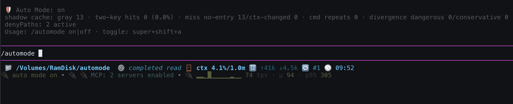
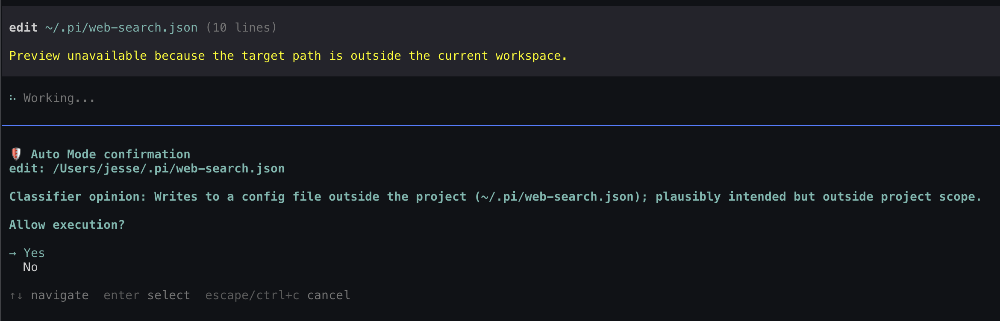

# pi-verdict

**[English](README.md)** | [简体中文](README.zh-CN.md)

[](LICENSE)
[](https://www.npmjs.com/package/pi-verdict)
[](https://pi.dev)

**pi-verdict is a minimal permission gate for [pi](https://pi.dev) in the style of Claude Code's auto mode: every tool call gets checked before it runs — allow, deny, or ask you first.**

- Minimal — just a few hundred lines of code
- Built-in danger rules and your own allow/deny rules settle the clear cases first, at zero latency
- Everything else goes to a model classifier that sees the conversation context
- Any uncertainty or failure fails closed; nothing ever runs silently
- Self-protection: the gate guards itself against snooping and tampering

## The problem

pi has no built-in permission prompts — every tool call executes with the permissions of the pi process ([pi security docs](https://pi.dev/docs/latest/security)).

pi-verdict adds the missing gate: a model decides whether each call should run, based on the conversation context and your intent.

## Why three states

**verdict is an adjudication, not a switch.** Most classifiers in this space output a binary allow/block. Three states matter: `ask` routes genuinely ambiguous actions to a human (and degrades to `deny` in non-interactive sessions), so "not sure" never silently becomes "go ahead" — the goal is safe automation, not maximum automation: both approval fatigue and silent unsafe execution lose.

## Design principles

A small set of security principles shapes the whole gate — the full statement, with the honest edges, lives in [docs/security-principles.md](docs/security-principles.md):

- **Fail closed** — uncertainty produces friction, never permission.
- **Deterministic floor before AI** — hard denies are never overridden by the classifier or user allow rules.
- **Semantics over syntax** — a long read-only pipeline may auto-allow while a short destructive one still denies; the classifier judges what an action *does*, not how long it is.
- **Judgments, not proofs** — a classifier `allow` is an informed opinion; the floor exists because that is all it is.
- **Minimal trusted input** — no tool results in the transcript (#22), zero path plaintext to the classifier (ADR-0002).
- **Canonical identity** — lexical + realpath dual-form matching; a workspace-*looking* path is not trusted as one (#20/#21).
- **The gate guards itself** — self-protection that no configuration can disable (ADR-0001).
- **A permission gate, not a sandbox** — stack OS isolation on top; this gate never replaces it.

## Screenshots




## Quick start

```bash
# install from npm (pi):
pi install npm:pi-verdict

# install from npm (oh-my-pi / omp):
omp plugin install npm:pi-verdict

# or directly from git — try it once
pi --extension ./extensions/auto-mode.ts

```

### Hosts

pi-verdict runs on both [pi](https://github.com/badlogic/pi-mono) and [oh-my-pi](https://github.com/can1357/oh-my-pi) (omp) — it self-anchors to whichever agent tree it is installed in, and follows the extension copy's own location on dual-install machines. On omp 18 the classifier's completion call falls back to the pi-ai compat API (still fail-closed). Details: [docs/configuration.md](docs/configuration.md#host-notes-pi-and-oh-my-pi).

| | pi | omp |
|---|---|---|
| install | `pi install npm:pi-verdict` | `omp plugin install npm:pi-verdict` |
| extension copy | `~/.pi/agent/extensions/` | `~/.omp/agent/plugins/node_modules/pi-verdict/` |
| user rules | `~/.pi/agent/config/pi-verdict.json` | `~/.omp/agent/config/pi-verdict.json` |
| credential file (S0 hard deny) | `~/.pi/agent/auth.json` | `~/.omp/agent/auth.json` |

- `/automode` — show current status: on/off + shadow-cache stats for the session
- `/automode on`
- `/automode off`
- `ctrl+shift+a` — toggle the master switch silently (the always-on footer is the only feedback; rebind or disable via `toggleShortcut`)
- footer always shows `auto mode on` (green) / `auto mode off` (yellow)

| Option | Default | Description |
|---|---|---|
| `--auto-mode` / `--no-auto-mode` | on | master switch |
| `--auto-mode-model provider/id` | session model | classifier model ("self-reflection" by default) |
| `--auto-mode-debug` | off | full verdict notifications |
| `PI_AUTO_MODE_MODEL` | — | env form of the model flag |
| `PI_AUTO_MODE_DEBUG=1` | off | env form of debug (flag wins) |

### User rules (`~/.pi/agent/config/pi-verdict.json`)

```json
{
  "allow": ["^ls\\b", "^git (status|log|diff)\\b"],
  "deny":  ["rm ", "docker ", "^/etc/"],
  "denyPaths": ["~/Documents/private", "~/work/company"],
  "builtinDenyFloor": true,
  "classifierModel": null,
  "toggleShortcut": "ctrl+shift+a"
}
```

- `allow`/`deny` are JS regex arrays; **`deny` wins over `allow`**, both beat the classifier
- `denyPaths` are plain paths you declare **protected** — touches trigger a terminal ask you adjudicate (non-interactive → deny); the classifier never learns the paths themselves, only that they exist
- `builtinDenyFloor: false` turns off the built-in danger/path floor (your risk; the self-protection layer below always stays on)
- `classifierModel` pins the classifier model, e.g. `"zai/glm-5.3-flash:low"` (thinking suffix supported; default: session model with thinking off)

No built-in allowlist — every "always allow" claim is yours ([why](docs/configuration.md#why-no-built-in-allowlist)). Full reference: [docs/configuration.md](docs/configuration.md).

### Self-protection (the gate guards itself — [ADR-0001](docs/adr/0001-self-protection-layer.md))

The gate's own files — the config and the installed extension copy — are **user-editable only**: writes from inside the gate hard-deny (reads pass); your editor never passes through the gate, the sudoers/visudo precedent.

- **Not disableable by any config** — `builtinDenyFloor: false` and user `allow` rules cannot touch this layer
- **Tamper detection** as the backstop: watched files are snapshotted at `session_start` and re-verified before every verdict — a changed extension copy is auto-restored and the session goes fail-closed; a changed config gets one explicit keep/restore confirm ([ADR-0001](docs/adr/0001-self-protection-layer.md) for the differential-disposal rationale)

Requires pi ≥ 0.84. Works in interactive and non-interactive (`-p`/json/rpc) sessions; in non-interactive modes `ask` degrades to `deny`.

## How it compares

| | three-state verdict | classifier sees context | fail direction | runtime deps |
|---|---|---|---|---|
| **pi-verdict** | ✅ allow / ask / deny | ✅ recent user intent + tool calls | **closed** (errors/timeout/bad output → deny; headless ask → deny) | **0** |
| [@czottmann/pi-automode](https://github.com/czottmann/pi-automode) | rules 3-state, classifier 2-state | ✅ budgeted transcript | closed | 1 |
| [@zhushanwen/pi-permission](https://www.npmjs.com/package/@zhushanwen/pi-permission) | ✅ (outcome) | ❌ single-turn, no context | closed (→ ask) | 4 |
| [@gotgenes/pi-permission-system](https://github.com/gotgenes/pi-packages) | ✅ deterministic only | — (no built-in classifier) | closed | 3 |

Full landscape: [`research/pi-permission-landscape.md`](research/pi-permission-landscape.md) · convergence analysis with the closest architectural relative: [`research/pi-automode-convergence.md`](research/pi-automode-convergence.md).

Honest framing: pi-automode and pi-verdict have **converged on the same architecture** (deny floor → user rules → classifier, fail-closed — see the convergence analysis). What remains distinct here: a classifier that can say `ask` (runtime human-in-the-loop, not just rule-declared), a built-in floor you can turn off (`builtinDenyFloor` — user sovereignty), a self-protection layer that no config can turn off ([ADR-0001](docs/adr/0001-self-protection-layer.md) — gate integrity), a zero-dependency single file ([one readable file](extensions/auto-mode.ts), still one file on purpose), and the measurement habit — every design decision in this repo is backed by shipped research.

## Pipeline

```
tool_call
  │
  ├─ 0. Self-protection layer (ADR-0001; not disableable by any config)
  │     ├─ write/edit/bash touching the gate's own files → deny; reads pass
  │     └─ tamper detection: re-verify before every verdict →
  │         auto-restore + fail-closed, or one keep/restore confirm
  │
  ├─ 1. Rule layer (deterministic, zero latency)
  │     ├─ built-in deny floor: bash danger regexes + path sensitivity S0–S5
  │     ├─ your rules: user deny beats user allow
  │     ├─ denyPaths (ADR-0002): protected paths → terminal ask,
  │     │   before user allow; classifier sees an existence hint only
  │     └─ no built-in allowlist — every "always allow" claim is yours to make
  │
  ├─ 2. Gray zone → model classifier (defaults to session model — "self-reflection")
  │     ├─ input: CC-style <transcript> — recent user intent + tool calls,
  │     │        action under review always last
  │     └─ output contract: <verdict>allow|ask|deny</verdict> prefix-anchored
  │
  └─ 3. Three-state adjudication
        ├─ allow → pass
        ├─ deny  → block, reason returned to the agent
        └─ ask   → human confirm; non-interactive modes degrade to deny

  [shadow cache] observe-only telemetry alongside 2/3, never changes a verdict
```

**fail-closed**: classifier exception / timeout (25s) / contract violation → deny. Never silently allow.

## Evidence-driven, not vibes-driven

Design decisions here are settled by measurement, and the lab notes ship with the repo:

- [`research/cache-sim`](research/cache-sim/README.md) — replayed 1.2k+ real classifier verdicts to measure verdict-cache hit rate (**3.2%** → cache deferred, shadow-mode telemetry built instead)
- [`research/thinking-param-blackhole.md`](research/thinking-param-blackhole.md) — three-layer forensic root-cause of thinking models burning the classifier budget; why the fix is `thinkingEnabled: false`
- [`research/rule-engine-sim`](research/rule-engine-sim/README.md) — measured a tree-sitter rule-engine port against 746 real bash calls (**absorbs 0 gray calls**) and rejected it
- [`research/pi-permission-landscape.md`](research/pi-permission-landscape.md) — the competitive landscape this README's positioning is checked against
- [`research/rule-layer-security-audit.md`](research/rule-layer-security-audit.md) — rule-layer bypass testing (8/8 reproduced → fixed architecturally in 0.2.0)
- [`research/pi-automode-convergence.md`](research/pi-automode-convergence.md) — where this project genuinely converges with pi-automode, and what remains distinct
- [`research/claude-code-classifier-prompts.md`](research/claude-code-classifier-prompts.md) — structural reconstruction of Claude Code's classifier design (via self-hosted Langfuse observations) that this extension's transcript contract descends from

## Status & limitations

- no built-in allowlist by design (see the [bypass writeup](research/rule-layer-security-audit.md)); with an empty `allow` config most commands go to the classifier — point `--auto-mode-model` at a fast model if per-call latency matters
- the path sensitivity floor applies to file tools only: bash command strings are matched by the danger regexes alone, so e.g. `cat ~/.ssh/id_rsa` goes to the classifier rather than the deterministic S0 deny (the file-tool spelling `read ~/.ssh/id_rsa` does deny)
- on Windows the built-in floor covers bash-shaped patterns only — PowerShell-native dangerous commands (`Remove-Item -Recurse -Force`, `Invoke-Expression`, `Set-ExecutionPolicy`, …) rely on the classifier (fail-closed)
- AGENTS.md is not passed to the classifier as downweighted intent evidence (Claude Code does this)
- parallel gray-zone calls are adjudicated serially
- self-reflection means the session model adjudicates — point `--auto-mode-model` at a lighter model if verdict latency/cost matters (open question tracked in the issue tracker)
- shadow cache is observe-only by decision; the serving switch is a one-line change once measured hit rates justify it
- `denyPaths` bash extraction is token-level ([ADR-0002](docs/adr/0002-deny-paths-deterministic-ask.md)): command substitution, base64-embedded paths and external script contents produce no hit signal — those calls fall back to the classifier's existence-hint vigilance. MCP and custom tools bypass the extractor entirely (their gray-zone adjudication still carries the hint). Honest framing, same as the self-protection substring precedent: the deterministic layer is obfuscatable, which is exactly why a hit routes to *you* rather than silently deciding
- `denyPaths` bash tokens contain no spaces: a *declared* path containing spaces cannot be spelled in a bash command in a way the extractor sees — `cat "/path with space/x"` splits into two tokens and never hits (file tools still hit, their path is not tokenized). A glob covering the final segment of a base (`cat /proj/pers*` against `denyPaths: ["/proj/personal"]`) also misses — the base's own name never appears literally. Both holes fall back to the classifier's existence hint, alongside substitution/base64 above
- self-protection bash matching is substring regex — obfuscatable; the tamper-detection backstop catches within-session bypasses, but a cross-session baseline (hash + change confirmation at startup, incl. upgrade UX) is phase 2 per [ADR-0001](docs/adr/0001-self-protection-layer.md)
- dev checkouts (running the extension from a repo, not `<agentDir>/extensions/`) are not self-protected — the installed copy the *next* normal session loads is only covered by its own sessions' gate

**verdict is not a sandbox.** It runs inside the pi process and adjudicates tool calls; it does not contain malicious code, protect against a compromised process, or guard manual `!` shell escapes. For isolation, use an OS-level sandbox.

The name: the three-state **verdict** is the core concept. The UX keeps `/automode` — the mode concept traces back to Claude Code's auto mode, which this project borrows its transcript design from.

## Development

```bash
bun install
bun run typecheck
bun test          # offline stub tests: self-protection, tamper detection, deny floor, user rules, denyPaths, bypass regression, classifier retry, shadow cache, commands, toggle shortcut
```

Issue tracker and decision records live in the GitHub issues ("map" issue #1 indexes them).

## License

[MIT](LICENSE)
