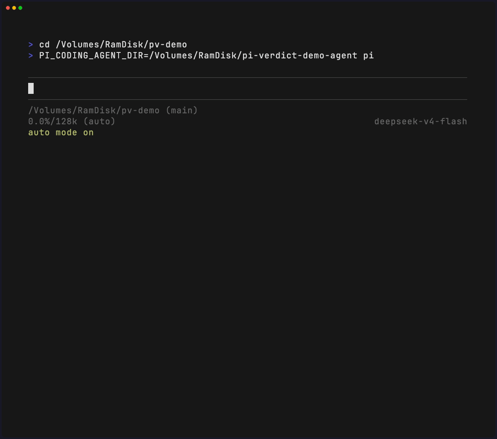

# pi-verdict

[English](README.md) | **[简体中文](README.zh-CN.md)**

[](LICENSE)
[](https://www.npmjs.com/package/pi-verdict)
[](https://pi.dev)

**pi-verdict 是 [pi](https://pi.dev) 的 Claude Code 风格的 Auto mode 式的极简权限门禁:每次工具调用执行前先过检查——放行、拦截,或先问你。**

- 只有1k行左右的极简代码
- 内置危险规则与你的 allow/deny 规则以零延迟先行裁决明确情形
- 其余交给携带会话上下文的模型分类器
- 任何不确定或失败一律 fail-closed, 绝不静默放行
- 自我保护: 防止被窥探和篡改

## 问题

pi 没有内置的逐次权限确认——每次工具调用都以 pi 进程自身的权限直接执行([pi 安全文档](https://pi.dev/docs/latest/security))。

pi-verdict 补上这道缺失的门禁, 由模型基于上下文和你的意图判定是否可以运行.

## 为什么是三态

**verdict 是裁决,不是开关。** 本品类的分类器大多只输出二值 allow/block。三态有意义的地方在:`ask` 把真正含糊的动作转交人类确认(非交互会话中降级为 `deny`),「不确定」永远不会静默变成「放行」——目标是安全的自动化而非最大的自动化:审批疲劳与静默危险执行都是危险。

## 设计原则

- **Fail closed**——不确定产生摩擦,绝不产生许可。
- **确定性 floor 先于 AI**——硬 deny 永不被分类器或用户 allow 规则覆盖。
- **语义优先于语法**——分类器判定的是动作**做什么可能会产生什么安全影响**,而不是命令有多长。
- **是判断,不是证明**——分类器的 `allow` 是有依据的判断;floor 的存在正因为它仅此而已。
- **最小化可信输入**——transcript 不含工具结果(#22),分类器零路径明文(ADR-0002)。
- **规范化身份**——词法 + realpath 双形匹配;「看起来在项目内」的路径不因此被信任(#20/#21)。
- **门禁守护自身**——任何配置都关不掉的自保护层(ADR-0001)。
- **是权限门禁,不是沙箱**——请在上面叠加 OS 级隔离;本门禁不替代它。

完整表述见 [docs/security-principles.md](docs/security-principles.md):


## 截图




## 快速开始

```bash
# 从 npm 安装(pi):
pi install npm:pi-verdict

# 从 npm 安装(oh-my-pi / omp):
omp plugin install npm:pi-verdict

# 或直接从源码 —— 试用一次
pi --extension ./extensions/auto-mode.ts

```

### 宿主

pi-verdict 同时支持 [pi](https://github.com/badlogic/pi-mono) 与 [oh-my-pi](https://github.com/can1357/oh-my-pi)(omp)——扩展按自身安装位置自锚定到所在宿主的目录树,双宿主并存的机器上跟随扩展副本自身的位置。omp 18 下分类器的模型调用经 pi-ai compat API 降级(仍然 fail-closed)。细节见 [docs/configuration.md](docs/configuration.md#host-notes-pi-and-oh-my-pi)。

| | pi | omp |
|---|---|---|
| 安装 | `pi install npm:pi-verdict` | `omp plugin install npm:pi-verdict` |
| 扩展副本 | `~/.pi/agent/extensions/` | `~/.omp/agent/plugins/node_modules/pi-verdict/` |
| 用户规则 | `~/.pi/agent/config/pi-verdict.json` | `~/.omp/agent/config/pi-verdict.json` |
| 凭据文件(S0 硬 deny) | `~/.pi/agent/auth.json` | `~/.omp/agent/auth.json` |

- `/automode` —— 显示当前状态:开/关 + 本会话影子缓存统计
- `/automode on`
- `/automode off`
- `ctrl+shift+a` —— 静默切换主开关(footer 始终显示为唯一反馈;键位可经 `toggleShortcut` 重绑或禁用)
- footer 恒显 `auto mode on`(绿色)/ `auto mode off`(黄色)

| 配置 | 默认 | 说明 |
|---|---|---|
| `--auto-mode` / `--no-auto-mode` | 开 | 总开关 |
| `--auto-mode-model provider/id` | 会话模型 | 分类器模型(默认"自省") |
| `--auto-mode-debug` | 关 | 全量裁决通知 |
| `PI_AUTO_MODE_MODEL` | — | 模型配置的环境变量形式 |
| `PI_AUTO_MODE_DEBUG=1` | 关 | 调试的环境变量形式(flag 优先) |

### 用户自定义规则(`~/.pi/agent/config/pi-verdict.json`)

```json
{
  "allow": ["^ls\\b", "^git (status|log|diff)\\b"],
  "deny":  ["rm ", "docker ", "^/etc/"],
  "denyPaths": ["~/Documents/private", "~/work/company"],
  "builtinDenyFloor": true,
  "classifierModel": null,
  "toggleShortcut": "ctrl+shift+a"
}
```

- `allow`/`deny` 为 JS 正则数组;**`deny` 优先于 `allow`**,两者都优先于分类器
- `denyPaths` 是你声明**受保护**的普通路径列表:触碰触发**终局 ask** 由你裁决(非交互降级 deny);分类器只被告知路径**存在**,路径明文永不出本机
- `builtinDenyFloor: false` 整体关闭内置危险/路径拦截(风险自担;下方自保护层永远开启)
- `classifierModel` 指定分类器模型,如 `"zai/glm-5.3-flash:low"`(支持思考后缀;缺省 = 会话模型且显式关思考)

没有内置白名单——每一条「永远放行」声明都归你([为什么](docs/configuration.md#why-no-built-in-allowlist))。完整参考:[docs/configuration.md](docs/configuration.md)。

### 自保护(门禁守护自身——[ADR-0001](docs/adr/0001-self-protection-layer.md))

门禁自身的文件——配置与扩展安装副本——**仅用户可改**:门禁之内的写入一律硬 deny(读放行);你的编辑器修改不经门禁,最近的同构先例是 sudoers 必须经 visudo。

- **不可经任何配置关闭**——`builtinDenyFloor: false` 与用户 `allow` 规则都动不了这一层
- **变更检测**作纵深兜底:受保护文件在 `session_start` 快照、每次裁决前复核——扩展副本被改 → 自动还原 + 本会话 fail-closed;配置被改 → 一次明确的双选确认(差分处置的完整语义见 [ADR-0001](docs/adr/0001-self-protection-layer.md))

需要 pi ≥ 0.84。交互与非交互(`-p`/json/rpc)会话均支持;非交互模式下 `ask` 降级为 `deny`。

## 与品类对比

| | 三态裁决 | 分类器携带上下文 | fail 方向 | 运行时依赖 |
|---|---|---|---|---|
| **pi-verdict** | ✅ allow / ask / deny | ✅ 近期用户意图 + 工具调用 | **closed**(异常/超时/违约 → deny;非交互 ask → deny) | **0** |
| [@czottmann/pi-automode](https://github.com/czottmann/pi-automode) | 规则三态,分类器二态 | ✅ 预算化 transcript | closed | 1 |
| [@zhushanwen/pi-permission](https://www.npmjs.com/package/@zhushanwen/pi-permission) | ✅(outcome) | ❌ 单轮无上下文 | closed(→ ask) | 4 |
| [@gotgenes/pi-permission-system](https://github.com/gotgenes/pi-packages) | ✅ 纯确定性 | —(无内置分类器) | closed | 3 |

完整全景:[`research/pi-permission-landscape.md`](research/pi-permission-landscape.md) · 与最近架构亲缘的收敛分析:[`research/pi-automode-convergence.md`](research/pi-automode-convergence.md)。

诚实地说:pi-automode 与 pi-verdict 在**架构上已收敛**(deny floor → 用户规则 → 分类器,fail-closed——见收敛分析)。这里仍然不同的是:分类器能说 `ask`(运行时人工介入,而非仅由规则预声明)、内置 floor 可以关(`builtinDenyFloor`——用户主权)、任何配置都关不掉的自保护层([ADR-0001](docs/adr/0001-self-protection-layer.md)——门禁完整性)、零依赖的[可通读单文件](extensions/auto-mode.ts)(仍刻意单文件)、以及测量的习惯——本仓库每个设计决策都有随库研究背书。

## 管线

```
tool_call
  │
  ├─ 0. 自保护层(ADR-0001;不可经任何配置关闭)
  │     ├─ write/edit/bash 触碰门禁自身文件 → deny;读放行
  │     └─ 变更检测:每次裁决前复核 →
  │         自动还原 + fail-closed,或一次保留/还原确认
  │
  ├─ 1. 规则层(确定性,零延迟)
  │     ├─ 内置 deny floor:bash 危险正则 + 路径敏感度 S0–S5
  │     ├─ 用户规则:deny 优先于 allow
  │     ├─ denyPaths(ADR-0002):受保护路径 → 终局 ask,先于用户 allow;
  │     │   分类器只见存在性话术
  │     └─ 无内置白名单 —— 「永远放行」的声明由你自己做
  │
  ├─ 2. 灰区 → 模型分类器(默认继承会话模型 —— "自省")
  │     ├─ 输入:CC 风格 <transcript> —— 近期用户意图 + 工具调用,
  │     │        待审动作固定在末尾
  │     └─ 输出契约:<verdict>allow|ask|deny</verdict> 前缀锚定
  │
  └─ 3. 三态裁决
        ├─ allow → 放行
        ├─ deny  → 拦截,理由回传 agent
        └─ ask   → 人工确认;非交互模式降级为 deny

  [影子缓存] observe-only 遥测,与 2/3 并行,永不改变裁决
```

**fail-closed**:分类器异常 / 超时(25s)/ 输出违反契约 → 拦截,绝不静默放行。

## 证据驱动,不靠直觉

这里的设计决策用测量收敛,实验记录随仓库发布:

- [`research/cache-sim`](research/cache-sim/README.md) —— 回放 1.2k+ 条真实分类器裁决,实测裁决缓存命中率(**3.2%** → 缓存暂缓,改建影子模式遥测)
- [`research/thinking-param-blackhole.md`](research/thinking-param-blackhole.md) —— 思考模型烧尽分类器预算的三层取证,以及为什么修复是 `thinkingEnabled: false`
- [`research/rule-engine-sim`](research/rule-engine-sim/README.md) —— 用 746 条真实 bash 调用实测 tree-sitter 规则引擎移植(**灰区吸收 0 条**)并否决
- [`research/pi-permission-landscape.md`](research/pi-permission-landscape.md) —— 本 README 定位所对照的竞品全景
- [`research/rule-layer-security-audit.md`](research/rule-layer-security-audit.md) —— 规则层绕过测试(8/8 复现 → 0.2.0 架构性修复)
- [`research/pi-automode-convergence.md`](research/pi-automode-convergence.md) —— 与 pi-automode 何处真正收敛、何处仍然不同
- [`research/claude-code-classifier-prompts.md`](research/claude-code-classifier-prompts.md) —— Claude Code 分类器设计的结构化还原(基于自托管 Langfuse 观测),本扩展 transcript 契约的血统来源

## 状态与限制

- 设计上无内置白名单(见[绕过测试](research/rule-layer-security-audit.md)与[用户规则](#用户规则configpi-verdictjson));allow 配置为空时大多数命令进分类器 —— 延迟敏感可 `--auto-mode-model` 指向轻量模型
- 路径敏感度 floor 只作用于文件类工具:bash 命令串仅匹配危险正则——`cat ~/.ssh/id_rsa` 走分类器而非确定性 S0 拦截(文件工具拼写 `read ~/.ssh/id_rsa` 会拦截)
- Windows 下内置 floor 仅覆盖 bash 形态模式——PowerShell 原生危险命令(`Remove-Item -Recurse -Force`、`Invoke-Expression`、`Set-ExecutionPolicy` 等)依赖分类器兜底(fail-closed)
- AGENTS.md 未作为降权意图证据传入分类器(Claude Code 有此设计)
- 并行灰区调用串行裁决
- 自省意味着会话模型亲自裁决 —— 若延迟/成本敏感,用 `--auto-mode-model` 指向轻量模型(开放问题见 issue tracker)
- 影子缓存按决议仅观察不生效;实测命中率达标后,生效开关是一行改动
- `denyPaths` 的 bash 提取是 token 级([ADR-0002](docs/adr/0002-deny-paths-deterministic-ask.md)):命令替换、base64 内嵌路径、外部脚本内容不产生命中信号——这些调用回落到分类器的存在性话术警戒。MCP 与自定义工具完全绕过提取器(其灰区裁决仍带话术)。诚实表述,与自保护子串正则同例:确定性层可被混淆——这正是命中交由**你**裁决而非静默决定的原因
- `denyPaths` 的 bash token 不含空格:**声明路径本身含空格时**,bash 拼写无法被提取器识别——`cat "/path with space/x"` 被拆成两个 token 永不命中(文件类工具仍命中,其路径不经 token 化)。glob 覆盖基名末段(`denyPaths: ["/proj/personal"]` 时 `cat /proj/pers*`)同样漏过——基名自身从未字面出现。两个洞与上述替换/base64 一样回落到分类器的存在性话术
- 自保护 bash 匹配是子串正则——可被混淆绕过;变更检测兜底覆盖会话内绕过,跨会话基线(启动时哈希比对与变更确认,含升级 UX)按 ADR-0001 为二期
- dev checkout(从仓库而非 `<agentDir>/extensions/` 运行扩展)不受自保护——下一个正常会话加载的安装副本只在其自身会话的门禁内受保护

**verdict 不是沙箱。** 它在 pi 进程内裁决工具调用;不能遏制恶意代码、不能防护被攻陷的进程、不守护手工 `!` shell 逃逸。需要隔离请用操作系统级沙箱。

命名:三态**裁决(verdict)**是核心概念。UX 保留 `/automode` —— 模式概念上溯 Claude Code 的 auto mode,本项目亦借鉴了其 transcript 设计。

## 开发

```bash
bun install
bun run typecheck
bun test          # 离线桩测试:自保护 / 变更检测 / deny floor / 用户规则 / denyPaths / 绕过回归 / 分类器重试 / 影子缓存 / 命令 / toggle 快捷键
```

Issue tracker 与决策记录在 GitHub issues(「地图」issue #1 为索引)。

## 许可

[MIT](LICENSE)
